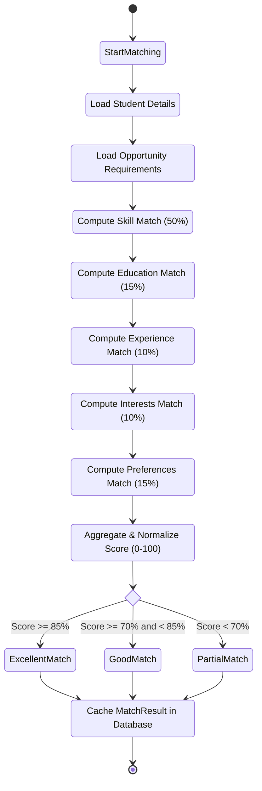

# Activity Diagram Documentation

This document describes the workflow of the Matching Engine and Skill Gap Analyzer.

```mermaid
stateDiagram-v2
    [*] --> StartMatching
    
    state "Load Student Details" as LoadStudent
    state "Load Opportunity Requirements" as LoadOpp
    state "Compute Skill Match (50%)" as SkillMatch
    state "Compute Education Match (15%)" as EduMatch
    state "Compute Experience Match (10%)" as ExpMatch
    state "Compute Interests Match (10%)" as IntMatch
    state "Compute Preferences Match (15%)" as PrefMatch
    state "Aggregate & Normalize Score (0-100)" as AggScore
    
    StartMatching --> LoadStudent
    LoadStudent --> LoadOpp
    
    LoadOpp --> SkillMatch
    SkillMatch --> EduMatch
    EduMatch --> ExpMatch
    ExpMatch --> IntMatch
    IntMatch --> PrefMatch
    
    PrefMatch --> AggScore
    
    state CheckThreshold <<choice>>
    AggScore --> CheckThreshold
    
    CheckThreshold --> ExcellentMatch : Score >= 85%
    CheckThreshold --> GoodMatch : Score >= 70% and < 85%
    CheckThreshold --> PartialMatch : Score < 70%
    
    state "Cache MatchResult in Database" as CacheResult
    ExcellentMatch --> CacheResult
    GoodMatch --> CacheResult
    PartialMatch --> CacheResult
    
    CacheResult --> [*]
```
