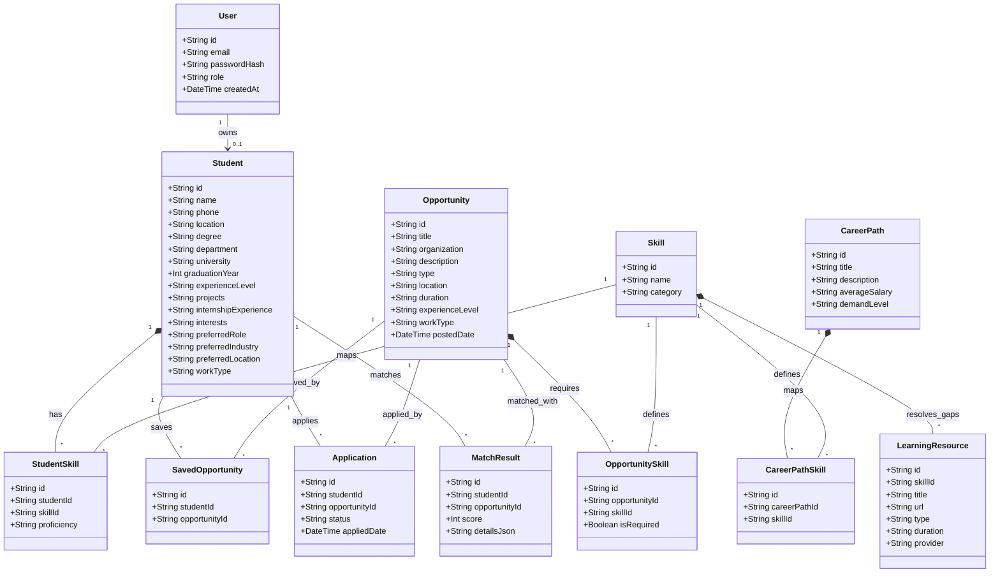

# Class Diagram Documentation

This document represents the object-oriented structure of the **SkillMatch AI** platform, defining key entities, attributes, and relationships.

---

## Entity Relationship Details
1. **Student - User (1:1)**: Every student account is associated with a single security credential entity.
2. **Student - StudentSkill (1:N)**: A student possesses multiple skills in their profile.
3. **Skill - StudentSkill / OpportunitySkill (1:N)**: Master skills are referenced in student profiles and opportunity requirements.
4. **Student - MatchResult (1:N)**: Represents the cached matching percentage compatibility with opportunities.
5. **CareerPath - LearningResource (1:N via Skill)**: Gaps are mapped to learning resources linked to specific skills within career path requirements.
