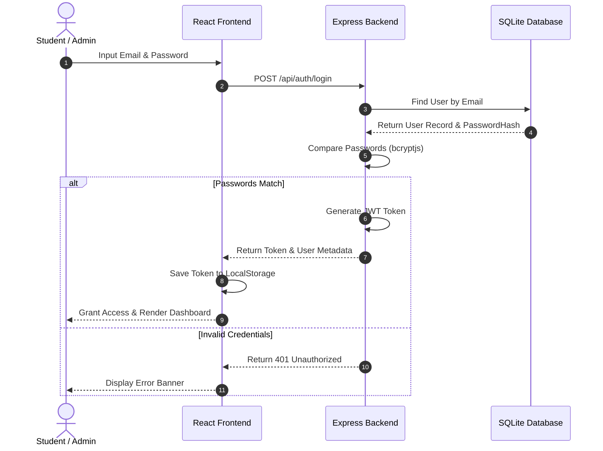
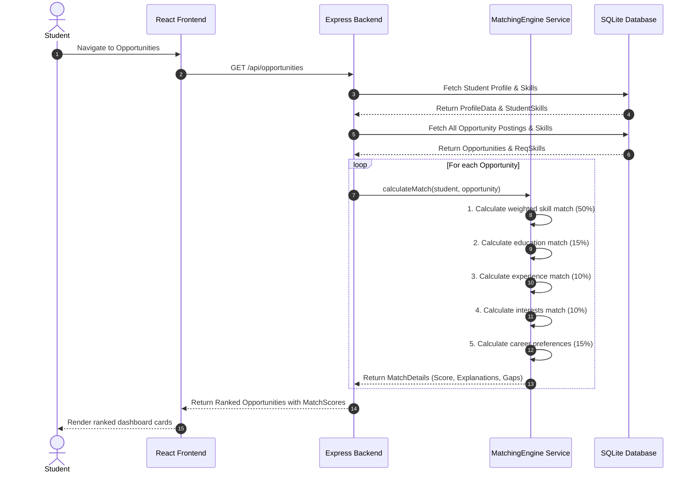

# Sequence Diagram Documentation

This document describes the runtime interactions between components during core system operations.

## 1. Authentication Flow

---

## 2. Match Score Calculation & Gap Analysis Flow

